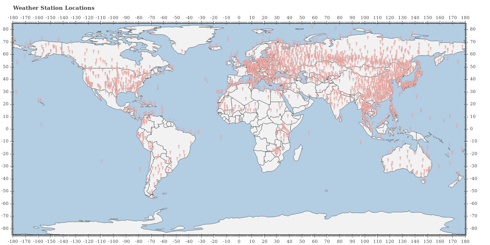

# aaisd
###### Python 2.7
###### Access and Analysis for ISD.

Tools for downloading and processing the NOAA ISD (Integrated Surface Database).

## Access

### Downloading a section of the ISD

###### If you want to download all data (all years) for a specific station, or group of stations

```
python ftp_scrape_union.py <pw> <union_file>
```
`<pw>` is the password used to log you on to the ftp server. Use your email address.
`<union_file>` is the path to the input data file.

The union file will be read one line at a time for station codes in USAF-WBAN format (x00000-00000). For example
```
107120-99999 SEMBACH (USAFB)               
107140-99999 ZWEIBRUECKEN                  
108380-99999 ULM (MIL/MET)                 
109620-99999 HOHENPEISSENBERG              
```
and 
```
010010-99999
010280-99999
010550-99999
010620-99999
```
are both valid formats.

###### If you want to download specific years for a specific station, or group of stations
```
python ftp_scrape_union.py <pw> <union_file> <year_begin> <year_end>
```
`<year_begin>` eg, 1950
`<year_end>` eg, 2010

Both years are inclusive.

## Analysis

Use the global summary-of-the-day data to generate statistical values such as mean, median and variance. The following script acts on the raw files as downloaded from the ftp server in the previous step.

```
python process_gsod_allstats.py
```


## Chart

The chart functionality comes courtesy of the Bokeh library which generates interactive html output. 

### Charting a world map
```
python chart/map_plot.py <union_file>
```

This will show all the locations on a geographic map of the world. 



[Interactive version of this map](https://jnmaloney.github.io/aaisd/points)

### Charting the statistics for any station

For any station, show the statistics that were generated by the analysis script.

### Charting the outliers in one plot

```
python chart/process_outliers_locs.py
```
